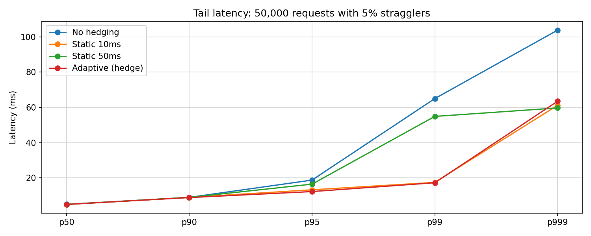
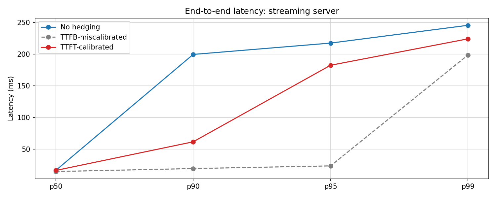

# hedge

[](https://goreportcard.com/report/github.com/bhope/hedge) [](https://pkg.go.dev/github.com/bhope/hedge) [](https://codecov.io/gh/bhope/hedge) [](LICENSE)

In a fan-out architecture with 100 backends, 63% of your requests hit at least one straggler (1 - 0.99^100).

hedge learns per-host latency distributions using DDSketch, fires a backup request when the primary exceeds its estimated p90, and caps hedge rate with a token bucket to prevent load amplification during outages. Result: p99 drops from 64ms to 17ms - a 74% reduction - with ~9% overhead. Zero configuration. Supports streaming workloads including LLM inference (measures time-to-first-token, not just headers).

Based on Dean & Barroso, ["The Tail at Scale"](https://research.google/pubs/the-tail-at-scale/) (CACM 2013) and Masson et al., ["DDSketch"](https://arxiv.org/abs/2004.08604) (VLDB 2019).

## Quick Start

```sh
go get github.com/bhope/hedge
```

```go
client := &http.Client{Transport: hedge.New(http.DefaultTransport)}
resp, err := client.Get("https://api.example.com/data")
```

## Table of Contents

- [Quick Start](#quick-start)
- [Evaluation](#evaluation)
- [How it works](#how-it-works)
- [Why not a static threshold?](#why-not-a-static-threshold)
- [Streaming / LLM inference](#streaming--llm-inference)
- [gRPC support](#grpc-support)
- [Configuration](#configuration)
- [Observability](#observability)
- [References](#references)
- [Contributing](#contributing)
- [License](#license)


## Evaluation

50,000 requests against a simulated backend with lognormal base latency (mean=5ms, stddev=2ms) and 5% straggler probability (10x multiplier).

| Configuration    |  p50  |  p90  |   p95  |   p99  |  p999   | Overhead |
|------------------|-------|-------|--------|--------|---------|----------|
| No hedging       | 5.0ms | 8.9ms | 17.1ms | 64.3ms | 104.5ms |    0.0%  |
| Static 10ms      | 5.0ms | 8.9ms | 13.1ms | 17.4ms |  46.5ms |    7.4%  |
| Static 50ms      | 5.0ms | 8.9ms | 18.9ms | 54.7ms |  60.2ms |    2.1%  |
| Adaptive (hedge) | 5.0ms | 8.9ms | 12.3ms | 17.0ms |  59.4ms |    8.9%  |

Adaptive matches the best hand-tuned static threshold at p99 (17.0ms vs 17.4ms) with no manual configuration. Static 50ms is too conservative at p95 (18.9ms vs 12.3ms); static 10ms over-hedges at p999 relative to adaptive. In production, where latency shifts with load and deployments, a fixed threshold goes stale; adaptive does not.



Reproduce: `cd benchmark/simulate && go run .`


## How it works

**1. DDSketch quantile estimator.** Each target host gets a `WindowedSketch`, a pair of DDSketches rotating every 30 seconds. DDSketch uses logarithmic bucket mapping to provide relative-error guarantees: any quantile estimate is within ±1% of the true value, regardless of the value's magnitude. This matters for latency: a 1% error on a 10ms p90 is 0.1ms, not a fixed absolute error. The rolling window ensures the sketch tracks current conditions, not the entire history.

**2. Adaptive trigger.** On each request, the transport queries the sketch for the configured percentile (default p90). For the first 20 requests to a new host, before the sketch has enough samples, a fixed 10ms warmup delay is used instead. If the primary has not responded by that deadline, a backup request is fired using a child context derived from the caller's. Whichever response arrives first is returned; the loser's context is cancelled and its body drained to return the connection to the pool.

**3. Token bucket budget.** Hedges are rate-limited by a token bucket that refills at `estimatedRPS × budgetPercent / 100` tokens per second (defaults: 100 RPS, 10%). During genuine outages, when every request stalls and the p90 estimate collapses to the minimum delay, the bucket drains within seconds and hedging stops, preventing the load-doubling spiral that would deepen the incident.


## Why not a static threshold?

A fixed 10ms threshold calibrated against today's traffic will be wrong tomorrow. Latency shifts with load, GC pauses, cold JVM instances after a deploy, and time of day. At off-peak, the real p90 might be 3ms, so a 10ms threshold never fires and provides no benefit. At peak, the real p90 might be 40ms, so a 10ms threshold hedges 90% of requests and doubles backend load. You would need per-service, per-environment thresholds updated continuously. The sketch updates on every completed request; the threshold is always current.


## Streaming / LLM inference

Most HTTP servers delay headers until the response is ready, so time-to-first-header (TTFH) ≈ total response latency and is a valid hedge signal. LLM inference servers differ: they commonly flush a `200 OK` before the first token is generated, then stream the response body. On these servers, TTFH is near-zero for every request; only time-to-first-token (TTFT), the latency to the first readable byte, reflects actual inference cost.

hedge records latency at first body byte via `ttftBody.Read`, not at header receipt. This gives the sketch the correct signal for prefill-disaggregated architectures where the header and the first token arrive tens to hundreds of milliseconds apart.

**Benchmark results** -- streaming server (200 OK flushed immediately; first token delayed):

| Mode               |  p50   |  p90    |  p95    |  p99    | LatencyEstimate(p80) |
|--------------------|--------|---------|---------|---------|----------------------|
| TTFB (old, broken) |  1.2ms |  2.0ms  |  2.3ms  |  3.0ms  | 1.6ms (near-zero: wrong signal) |
| TTFT (new, fixed)  | 16.4ms | 199.4ms | 216.0ms | 243.5ms | 25.9ms (actual inference latency) |

A hedge calibrated from the TTFB sketch would use a ~1ms delay and fire a redundant request on virtually every call. Calibrated from TTFT, it fires only on the slow 20% (cache misses).

**End-to-end latency** -- gateway server (TTFH ≈ TTFT, hedge fires while blocked on headers):

| Mode                          |  p50   |  p90    |  p95    |  p99    | Overhead |
|-------------------------------|--------|---------|---------|---------|----------|
| No hedging                    | 16.4ms | 199.6ms | 217.5ms | 245.6ms |    0.0%  |
| TTFB-miscalibrated (1ms)      | 14.7ms |  19.4ms |  23.6ms | 198.7ms |  100.0%  |
| TTFT-calibrated (p80 ≈ 47ms)  | 16.4ms |  61.6ms | 182.5ms | 224.2ms |   17.0%  |

The miscalibrated transport halves p90 but doubles load and barely touches p99. The TTFT-calibrated transport targets cache misses specifically, achieving meaningful p90 reduction at 17% overhead.



Reproduce: `cd benchmark/streaming && go run .`


## gRPC support

```go
conn, err := grpc.NewClient(target,
    grpc.WithTransportCredentials(insecure.NewCredentials()),
    grpc.WithUnaryInterceptor(hedge.NewUnaryClientInterceptor(
        hedge.WithEstimatedRPS(500),
        hedge.WithBudgetPercent(10),
    )),
)
```

All options are supported. Per-target latency tracking uses `cc.Target()` as the host key.


## Configuration

| Option | Type | Default | Description |
|--------|------|---------|-------------|
| `WithPercentile(q)` | float64 | 0.90 | Sketch quantile used as hedge trigger |
| `WithMaxHedges(n)` | int | 1 | Maximum concurrent hedge requests per call |
| `WithBudgetPercent(p)` | float64 | 10.0 | Max hedge rate as percent of total traffic |
| `WithEstimatedRPS(r)` | float64 | 100 | Expected requests per second; sets token bucket capacity |
| `WithMinDelay(d)` | time.Duration | 1ms | Floor on the hedge delay |
| `WithStats(s)` | `**Stats` | nil | Pointer to receive the live `Stats` struct |


## Observability

```go
var stats *hedge.Stats

client := &http.Client{
    Transport: hedge.New(http.DefaultTransport,
        hedge.WithStats(&stats),
    ),
}

// After requests:
snap := stats.Snapshot()
fmt.Printf("total=%d hedged=%d hedge_wins=%d budget_exhausted=%d\n",
    snap.TotalRequests,
    snap.HedgedRequests,
    snap.HedgeWins,
    snap.BudgetExhausted,
)
fmt.Printf("hedge_rate=%.2f\n", stats.HedgeRate())
```

`Stats` fields are `atomic.Int64` and safe to read concurrently. `Snapshot()` takes a consistent point-in-time copy. `HedgeRate()` returns `HedgedRequests / TotalRequests`.


## References

- Jeffrey Dean and Luiz André Barroso. ["The Tail at Scale."](https://research.google/pubs/the-tail-at-scale/) *Communications of the ACM*, 56(2):74-80, February 2013.
- Charles Masson, Jee E. Rim, and Homin K. Lee. ["DDSketch: A Fast and Fully-Mergeable Quantile Sketch with Relative-Error Guarantees."](https://arxiv.org/abs/2004.08604) *Proceedings of the VLDB Endowment*, 12(12):2195-2205, 2019.


## Contributing

Contributions are welcome! Please open an issue to discuss your idea before submitting a PR.

See [CONTRIBUTING.md](CONTRIBUTING.md) for development setup and guidelines.


## License

hedge is released under the [MIT License](LICENSE).
